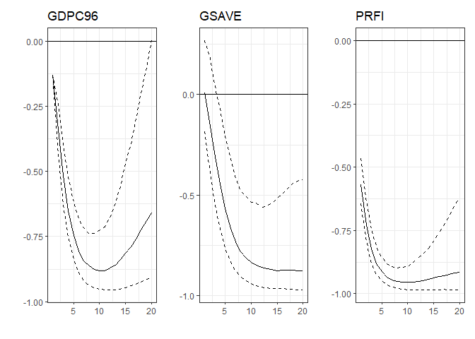

<!-- README.md is generated from README.Rmd. Please edit that file -->

# FAVAR

<!-- badges: start -->
<!-- badges: end -->

The goal of FAVAR is to estimate a FAVAR model by Bernanke et
al. (2005).

## Installation

You can install the development version of FAVAR from
[GitHub](https://github.com/) with:

``` r
# install.packages("devtools")
devtools::install_github("common2016/FAVAR")
```

## Example

This is a basic example which shows you how to estimate a FAVAR model:

``` r
# library(FAVAR)
devtools::load_all()
#> Loading FAVAR
## basic example code
data('regdata')
fit <- FAVAR(Y = regdata[,c("Inflation","Unemployment","Fed_funds")],
              X = regdata[,1:115], slowcode = slowcode,fctmethod = 'BBE',
              varprior = list(b0 = 0,vb0 = 10, nu0 = 0, s0 = 0),
              factorprior = list(b0 = 0, B0 = NULL, c0 = 0.01, d0 = 0.01),
              nrep = 500, nburn = 100, K = 2, plag = 2)
# print FAVAR estimation results
summary(fit,xvar = c(3,5))
#> Estimation VAR results for equation factor1 
#> -------------
#>                Estimate     se    q025    q975
#> factor1.1        0.7218 0.0037  0.5582  0.8814
#> factor2.1        0.1465 0.0027  0.0280  0.2625
#> Inflation.1      0.0218 0.0044 -0.1780  0.2079
#> Unemployment.1  -0.1710 0.0033 -0.3192 -0.0356
#> Fed_funds.1      0.0604 0.0017 -0.0148  0.1314
#> factor1.2        0.1995 0.0038  0.0406  0.3619
#> factor2.2       -0.0406 0.0024 -0.1428  0.0647
#> Inflation.2     -0.0302 0.0038 -0.1940  0.1486
#> Unemployment.2   0.1142 0.0032 -0.0178  0.2540
#> Fed_funds.2     -0.0126 0.0017 -0.0848  0.0633
#> --------------
#> Estimation VAR results for equation factor2 
#> -------------
#>                Estimate     se    q025    q975
#> factor1.1       -0.5106 0.0047 -0.7151 -0.3108
#> factor2.1        0.7948 0.0037  0.6310  0.9497
#> Inflation.1     -0.0059 0.0054 -0.2432  0.2308
#> Unemployment.1   0.3244 0.0047  0.1163  0.5330
#> Fed_funds.1     -0.0886 0.0026 -0.2030  0.0273
#> factor1.2        0.0064 0.0053 -0.2292  0.2389
#> factor2.2        0.0250 0.0033 -0.1318  0.1556
#> Inflation.2      0.1388 0.0048 -0.0622  0.3499
#> Unemployment.2  -0.3011 0.0045 -0.4956 -0.0971
#> Fed_funds.2      0.0182 0.0025 -0.0919  0.1326
#> --------------
#> Estimation VAR results for equation Inflation 
#> -------------
#>                Estimate     se    q025    q975
#> factor1.1        0.2321 0.0027  0.1102  0.3473
#> factor2.1        0.2740 0.0021  0.1800  0.3640
#> Inflation.1      0.9701 0.0033  0.8347  1.1267
#> Unemployment.1  -0.0392 0.0028 -0.1587  0.0912
#> Fed_funds.1     -0.0577 0.0014 -0.1194  0.0061
#> factor1.2        0.2513 0.0032  0.1175  0.3944
#> factor2.2        0.0791 0.0019 -0.0080  0.1649
#> Inflation.2     -0.1300 0.0029 -0.2700 -0.0098
#> Unemployment.2   0.0388 0.0027 -0.0857  0.1508
#> Fed_funds.2      0.0405 0.0014 -0.0174  0.1012
#> --------------
#> Estimation VAR results for equation Unemployment 
#> -------------
#>                Estimate     se    q025    q975
#> factor1.1        0.2851 0.0035  0.1351  0.4412
#> factor2.1       -0.3061 0.0027 -0.4188 -0.1888
#> Inflation.1     -0.0183 0.0043 -0.2028  0.1712
#> Unemployment.1   0.7606 0.0033  0.6265  0.9001
#> Fed_funds.1     -0.0092 0.0019 -0.0901  0.0743
#> factor1.2        0.1671 0.0040  0.0066  0.3477
#> factor2.2        0.1175 0.0024  0.0108  0.2166
#> Inflation.2      0.0155 0.0038 -0.1476  0.1800
#> Unemployment.2   0.1838 0.0032  0.0471  0.3134
#> Fed_funds.2      0.0254 0.0019 -0.0586  0.1018
#> --------------
#> Estimation VAR results for equation Fed_funds 
#> -------------
#>                Estimate     se    q025    q975
#> factor1.1       -0.0797 0.0055 -0.3205  0.1531
#> factor2.1        0.5992 0.0044  0.4183  0.7970
#> Inflation.1      0.1744 0.0066 -0.1133  0.4747
#> Unemployment.1   0.0673 0.0052 -0.1606  0.2936
#> Fed_funds.1      0.7527 0.0032  0.6167  0.8875
#> factor1.2        0.0520 0.0063 -0.2085  0.3618
#> factor2.2       -0.2888 0.0041 -0.4871 -0.1215
#> Inflation.2     -0.1358 0.0056 -0.3823  0.1023
#> Unemployment.2  -0.0852 0.0050 -0.3014  0.1509
#> Fed_funds.2      0.1838 0.0032  0.0563  0.3096
#> --------------
#> 
#> =================================================================================
#> Estimation results for the 3th equation in X = FY 
#> ------------
#>                  loading  loading_se        q025        q975
#> factor1      -1.68390725 0.011857036 -2.13008865 -1.08789590
#> factor2       0.57351588 0.007049173  0.28645862  0.88920757
#> Inflation     0.17500014 0.004882530 -0.03514514  0.36357533
#> Unemployment  0.05065144 0.002760542 -0.06667948  0.18144093
#> Fed_funds    -0.14186086 0.003393773 -0.28570561  0.01174437
#> -------------
#> Estimation results for the 5th equation in X = FY 
#> ------------
#>                 loading  loading_se        q025        q975
#> factor1      -0.5431962 0.012825894 -1.04440858  0.06499368
#> factor2       0.7660636 0.007873015  0.43876128  1.11441043
#> Inflation     0.1760928 0.005413527 -0.06253258  0.38725944
#> Unemployment  0.2045756 0.003149414  0.06955185  0.35321617
#> Fed_funds    -0.3872807 0.003923484 -0.55207957 -0.21091164
#> -------------
# plot impulse response figure
library(patchwork)
ans <- irf(fit,resvar = c(2,9,10), tcode = tcode, nhor = 21, showplot = T)
```



## Reference

-   Bernanke, B.S., J. Boivin and P. Eliasz, Measuring the Eeefects of
    Monetary Policy: A Factor-Augmented Vector Autoregressive (FAVAR)
    Approach. Quarterly Journal of Economics, 2005. 120(1): p. 387-422.
